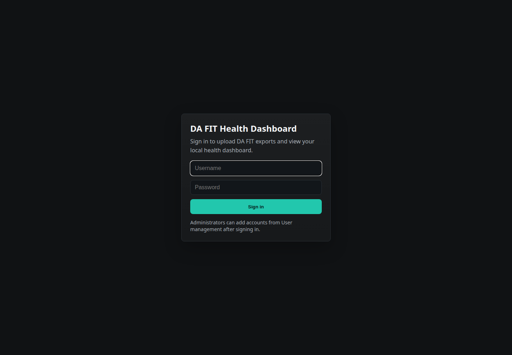
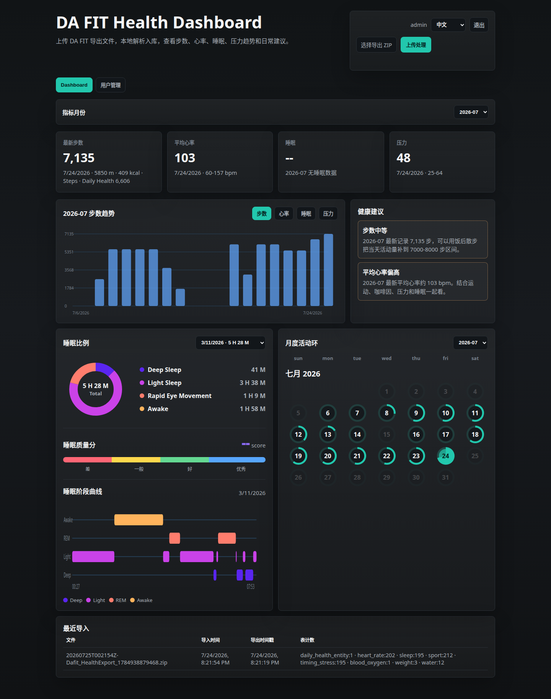
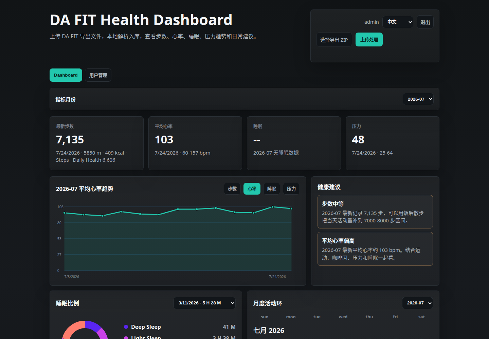
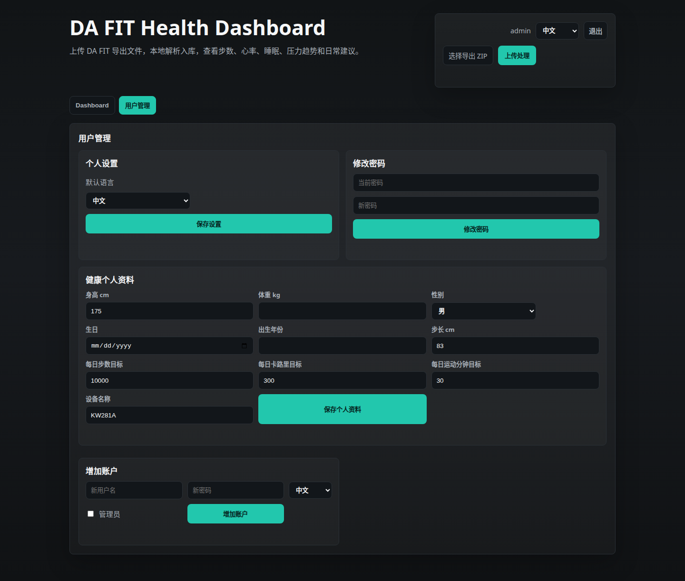
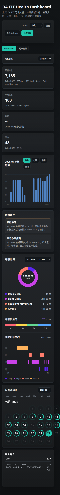

# DA FIT Health Dashboard

A self-hosted Docker web dashboard for DA FIT `export personal data` files.

The app lets you upload `Dafit_HealthExport_xxx.zip` exports from the DA FIT Android app, parses the JSON payload locally, stores health records in SQLite, and displays steps, heart rate, sleep, stress, monthly activity rings, import history, and account profile settings.

It is designed for local/home use and does not require root access to the Android phone.

## Features

- Upload DA FIT personal data exports as `.zip`, `.txt`, or `.json`.
- Parse and persist these DA FIT tables:
  - `sport`: steps, distance, calories, activity minutes, step buckets.
  - `heart_rate`: daily average, min, max heart rate.
  - `sleep`: deep sleep, light sleep, REM, awake time, sleep stage detail.
  - `timing_stress`: daily stress summaries.
  - `daily_health_entity`: DA FIT daily health summary and scoring fields.
  - selected auxiliary tables such as blood oxygen, weight, water, and goals.
- Dashboard cards and charts filtered by metric month.
- SVG trend charts with hover values for bars and line points.
- Daily heart-rate curve view from DA FIT's per-day `HEART_RATE` samples, with zero-value sensor dropouts shown separately.
- Sleep date selector with DA FIT-style sleep ratio and sleep stage timeline.
- Monthly activity ring calendar for every month with data.
- Month-aware health suggestions.
- Local username/password login with PBKDF2 password hashing and cookie sessions.
- Admin-managed accounts.
- Chinese/English UI switching; the login page is English.
- User management tab for password, default language, and health profile editing.
- Automatic health profile extraction from DA FIT `user_info` and `goals_setting`.
- Incremental import semantics so old history is not overwritten by later exports.
- Python standard library only at runtime; no pip install is required inside the image.

## Screenshots

### Login



### Dashboard



### Heart Rate Trend



### User Management



### Mobile View



## Quick Start with Docker

```bash
docker run -d \
  --name dafit-health-dashboard \
  --restart unless-stopped \
  -p 8088:8080 \
  -e DAFIT_ADMIN_PASSWORD='change-this-admin-password' \
  -v "$HOME/docker/dafit-health-dashboard:/data" \
  ghcr.io/yonggangg/da-fit-dashboard:latest
```

Open:

```text
http://localhost:8088/login
```

Default account:

```text
Username: admin
Password: the value of DAFIT_ADMIN_PASSWORD
```

`DAFIT_ADMIN_PASSWORD` is only used when the SQLite database creates the first `admin` user. If `/data/db/dafit_health.sqlite3` already exists, changing the environment variable will not reset the existing admin password.

## Portainer Stack Example

Create a host directory first:

```bash
mkdir -p /home/xin/docker/dafit-health-dashboard
chown -R xin:xin /home/xin/docker/dafit-health-dashboard
chmod 700 /home/xin/docker/dafit-health-dashboard
```

Paste this into Portainer Stack Editor:

```yaml
services:
  dafit-health-dashboard:
    image: ghcr.io/yonggangg/da-fit-dashboard:latest
    container_name: dafit-health-dashboard
    restart: unless-stopped
    user: "1000:1000"
    ports:
      - "8088:8080"
    environment:
      DAFIT_DATA_DIR: /data
      DAFIT_ADMIN_PASSWORD: "change-this-admin-password"
    volumes:
      - /home/xin/docker/dafit-health-dashboard:/data
    healthcheck:
      test: ["CMD", "python", "-c", "import urllib.request; urllib.request.urlopen('http://127.0.0.1:8080/health', timeout=3).read()"]
      interval: 30s
      timeout: 5s
      retries: 3
      start_period: 15s
```

After deployment, visit:

```text
http://<docker-host-ip>:8088/login
```

## Local Build

```bash
git clone https://github.com/YonggangG/Da-Fit-Dashboard.git
cd Da-Fit-Dashboard
docker compose up --build -d
```

Then open:

```text
http://localhost:8088/login
```

## Configuration

| Variable | Default | Description |
| --- | --- | --- |
| `DAFIT_DATA_DIR` | `/data` | Directory for SQLite database and uploaded export archives. |
| `DAFIT_HOST` | `0.0.0.0` | HTTP bind address inside the container. |
| `DAFIT_PORT` | `8080` | HTTP port inside the container. |
| `DAFIT_ADMIN_PASSWORD` | `change-me-admin-password` | Initial admin password for a fresh database only. |

## Input File

In the DA FIT app, use:

```text
Profile / Settings / Export personal data
```

The exported file is usually named like:

```text
Dafit_HealthExport_1784930329425.zip
```

The numeric suffix is a Unix epoch millisecond timestamp for the export generation time.

## Import Merge Policy

The current release is optimized for one watch/account, with a data model prepared for multiple users.

Repeated uploads for the same account do not replace all historical data:

- First upload imports all parseable records.
- Later uploads append records newer than the database's latest `sport` day.
- Dates older than the database's latest `sport` day are preserved.
- The database's previous latest day is replaced only if the new ZIP has a higher same-day `sport.STEPS` value.
- If same-day steps are not higher, that day is skipped and old records are preserved.

This fits DA FIT's partial same-day sync behavior: exporting again later in the day can improve today's record without rewriting old history.

## DA FIT Data Semantics

DA FIT exports contain more than one steps field:

- `sport.STEPS`: closest to the DA FIT Steps page and used as the dashboard's primary steps value.
- `daily_health_entity.STEPS_VALUE`: DA FIT daily health/scoring summary; it may differ from the Steps page.

The dashboard uses `sport.STEPS` for the main steps card and trend chart, while showing the Daily Health value as context when it differs.

Daily heart-rate curves use the raw `heart_rate.HEART_RATE` array from each DA FIT daily heart-rate record. Values above zero are drawn as the heart-rate line; zero values are treated as missing sensor readings and are shown as bottom markers rather than real heart-rate measurements.

## User Profile Rules

When a ZIP is uploaded, the app extracts health profile fields for the current logged-in user:

- From `user_info`: height, weight, birthday, gender, step length.
- From `goals_setting`: daily steps goal, calorie goal, activity minutes goal.
- A readable device name when available.

The app intentionally does not show device MAC addresses, Bluetooth addresses, notification tokens, or bond codes in the user management page.

`BIRTHDAY` is used for birthday. `BIRTH_YEAR` is not imported automatically; the Birth Year field remains available for manual editing.

## Security Notes

- This is a local self-hosted dashboard, intended for trusted home/LAN use.
- Passwords are stored as PBKDF2 hashes in SQLite.
- Session cookies are local HTTP cookies with `HttpOnly` and `SameSite=Lax`.
- Uploaded DA FIT archives may contain personal health information and device metadata. Keep the `/data` volume private.
- Health suggestions are simple lifestyle observations based on uploaded data. They are not medical advice.

## Release Image

Container images are published to GitHub Container Registry:

```text
ghcr.io/yonggangg/da-fit-dashboard:latest
ghcr.io/yonggangg/da-fit-dashboard:v0.2.0
ghcr.io/yonggangg/da-fit-dashboard:v0.1.0
```

## License

MIT License. See [LICENSE](LICENSE).
